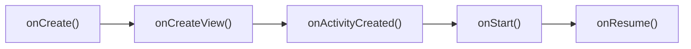
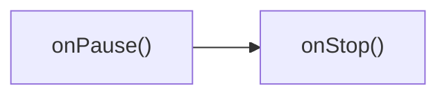
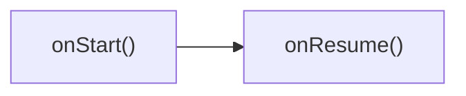
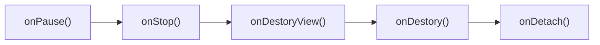

前段时间学完了Android 四大组件，写的 Demo App 基本都是直接用 Activity，后面看别人的 APP 大部分都是用的 Fragment ，这样效率高，界面切换也快，所以学习记录一下。

## Fragment 概要

Fragment 在 XML 中必须要有 `id` 或 `tag` ，例如：

其中，`android:name` 是指向的该 Fragment 对应的类名

```xml
<androidx.fragment.app.FragmentContainerView
                                             android:id="@+id/fragment_test"
                                             android:name="com.example.learn_825.TestFragment"
                                             android:layout_width="match_parent"
                                             android:layout_height="match_parent" />
```

官方说明：

> This `<fragment>` tag should specify an id or a tag to preserve state across activity restarts

## Fragment 创建

创建的时候最好判断一下 `view` 是否存在，存在就拿过来用，避免重复创建浪费系统资源

```java
private View rootView;
@Override
public View onCreateView(@NonNull LayoutInflater inflater, ViewGroup container,
                         Bundle savedInstanceState) {
    // Inflate the layout for this fragment
    if (rootView == null) {
        rootView = inflater.inflate(R.layout.fragment_test, container, false);
    }
    return rootView;
}
```

## Fragment 切换

如果要进行简单的 Fragment 的切换的话，下面是代码例子：

`replace`会使被替换的 Fragment 销毁，所以会触发 `onDestoryView()` 的生命周期

```java
private void replaceFragment(Fragment fragment) {
    FragmentManager fragmentManager = getSupportFragmentManager();
    FragmentTransaction fragmentTransaction = fragmentManager.beginTransaction();
    fragmentTransaction.replace(R.id.fragment_test, fragment);// 第一个参数是Fragment容器的id，第二个参数是要替换的fragment
    fragmentTransaction.addToBackStack(null);// 加入回退栈，返回时可以返回到上一个Fragment而不是直接退出Activity
    fragmentTransaction.commit();// 事务提交
}
```

## 通过 Bundle 传递数据

```java
// Activity
Bundle bundle = new Bundle();
bundle.putString("Rin", "哈哈哈哈哈");
TestFragment testFragment = new TestFragment();
testFragment.setArguments(bundle);
replaceFragment(testFragment);
// Fragment OnCreate
String message = getArguments().getString("Rin");
Log.d(TAG, "Message: " + message);
Toast.makeText(getContext(), "收到Bundle的信息：" + message, Toast.LENGTH_SHORT).show();
```

## Fragment 生命周期

1、打开界面



2、按下Home键



3、重新打开界面



4、按后退键

